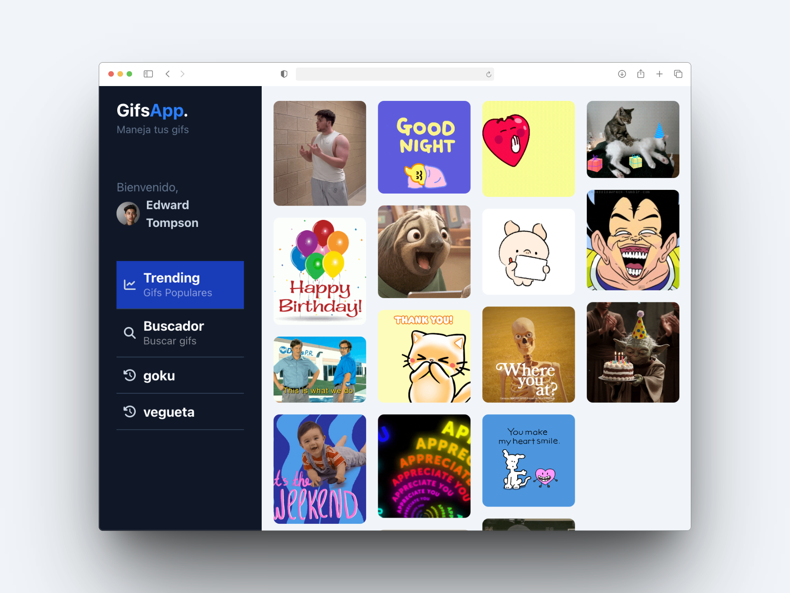
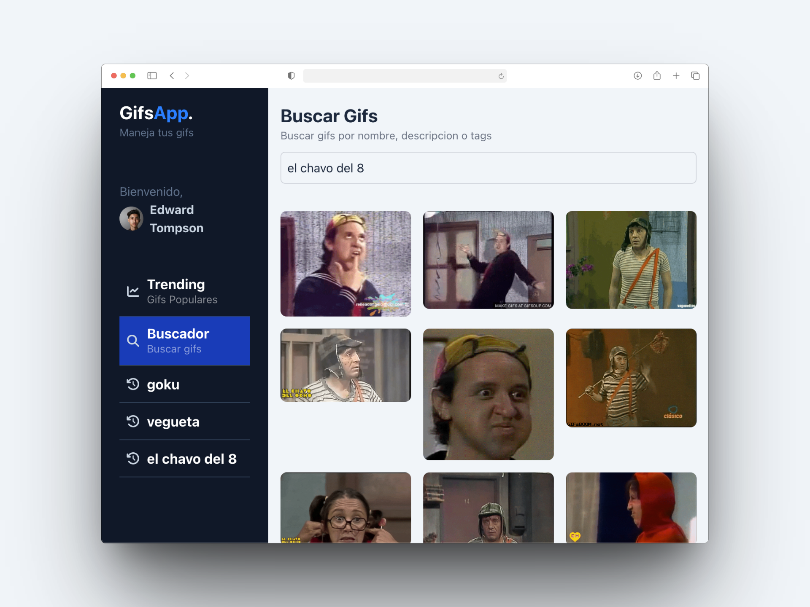

# GifsApp

## Resumen del código

GifsApp es una aplicación desarrollada en Angular que permite a los usuarios buscar, visualizar y gestionar GIFs animados. La estructura del proyecto incluye:

- **Componentes**: Elementos reutilizables como listas de GIFs, menús laterales y encabezados.
- **Páginas**: Vistas principales como la página de tendencias, historial de GIFs y búsqueda.
- **Servicios**: Lógica para interactuar con la API de Giphy y gestionar datos.
- **Interfaces**: Definiciones de tipos para garantizar consistencia en los datos.

La aplicación utiliza un diseño moderno y responsivo, con un menú lateral para navegar entre las diferentes secciones.

## Capturas de pantalla

### Página de Tendencias

### Página de Búsqueda

